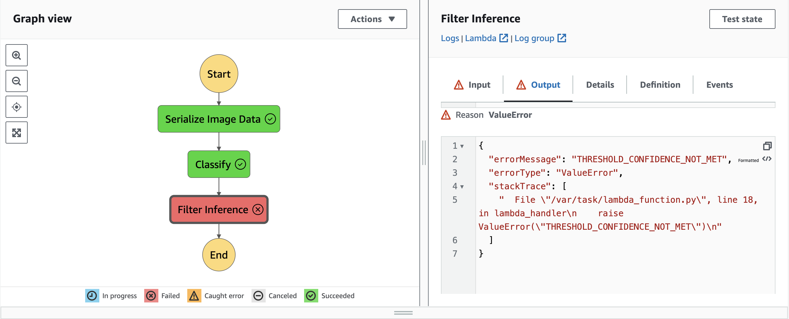

# Developing an Image Classification workflow using Amazon Web Services(AWS)

## Project Overview
As a part of the project assessment in Udacity's AWS Machine Learning Nanodegree Scholarship Program sponsored by AWS, this project implements an image classification system using Amazon SageMaker and AWS Step Functions. It enables the classification of images (bicycles vs. motorcycles) and integrates model monitoring, data capture, and serverless workflows.

## Project Structure
### Model Training and Deployment
1. Trained an image classification model using Amazon SageMaker built-in algorithm
2. Deployed it on a single ml.m5.xlarge instance with data capture configuration
3. Created an endpoint for making predictions

### Lambda Functions
1. serializeImageData: Copies an image from S3 and encodes it in base64
2. classifyImage: Decodes the image, performs classification using the SageMaker endpoint, and returns the inferences
3. filterInferences: Filters out low-confidence predictions (below a threshold of 0.7)

### Step Functions Workflow
Designed a Step Functions workflow that chains the Lambda functions together, handling inputs and outputs.
####  Failed step function when the inference value does not meet the threshold

####  Graph view of the working step function

####  Table view of the working step function

### Testing and Evaluation
1. Executed several Step Function invocations using test images to capture inferences
2. Downloaded and visualized inference data from SageMaker Model Monitor

## Conclusion
This project highlights developing and deploying an image classification model using Amazon Web Services. We built a system that classifies images while effectively monitoring performance and managing inputs through Lambda functions. The successful testing of this workflow shows its capability to handle both accurate predictions and errors efficiently.
